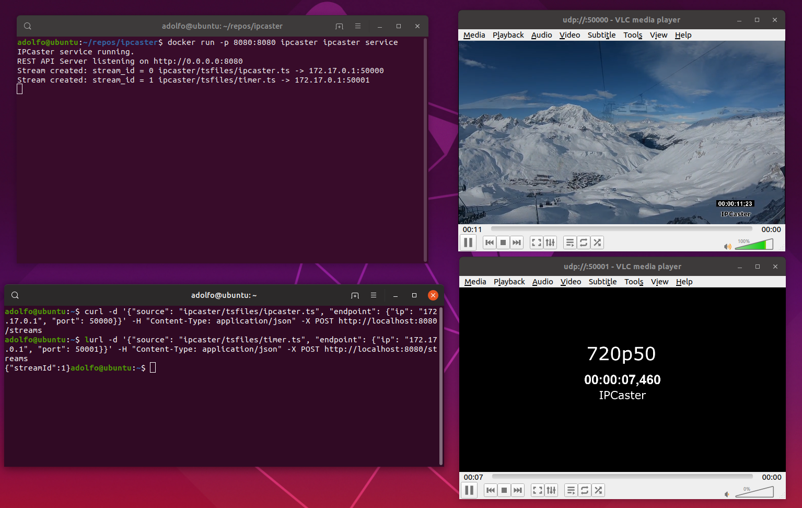

[](https://circleci.com/gh/adolfomarver/ipcaster)

# IPCaster
> MPEG Transport Stream over IP Sender

IPCaster is an open source application capable of simultaneously sending one or more MPEG-TS (ITU-T H.222) files through an IP network to a remote endpoint. The sending real-time bitrate of the stream will match the bitrate of the file so it can be received, decoded and rendered in real-time at the remote endpoint

The IP encapsulation is based on the SMPTE2022-2 standard.

### About MPEG-TS (ISO/IEC 13818-1 or ITU-T Recommendation H.222.0)

This format is the standard media container for TV (terrestrial, satellite, cable) media broadcasting systems (DVB, ATSC, ISDB). The media container allows to encapsulate and multiplex media streams such as video (mpeg-2, h.264, hevc,...), audio (mpeg-1 layer II, aac, ac3,...), metadata and signaling (teletext, subtitles, ...). All those streams can be grouped in programs and many different programs can be transported in one TS.

Sample TS files are included with the project in the **tsfiles/** directory

## Platforms

The code is written in C++11 and can be build, at least, in the following platforms:

* Linux on x86/x64
* Raspbian on Raspberry PI 3 B+
* Windows on x86/x64

The project uses CMake to support cross-platform building.

## Usage

```sh
ipcaster -s ts_file target_ip target_port ... [-s ...]
```


**ts_file** Is the file to send.

**target_ip** Is the IPv4 address of the endpoint.

**target_port** Is the IP port of the endpoint.

## Build and test

DevOps scripts for all the supported platforms can be found at **ipcaster/ops/[platform]**.
In the next section these scripts are use to build and test the application inside a Docker container

## Build and Test in a Docker container

```sh

# Clone the repository
git clone https://github.com/adolfomarver/ipcaster.git

# cd into ipcaster directory where Dockerfile resides
cd ipcaster

# Build the docker image. 
# The Dockerfile installs the build dependencies, build ipcaster and run the tests in an intermediate stage. 
# Then, in the final stage, generates a minimum dependency image with the required artifacts from the intermediate stage.
docker build -t ipcaster .

```

## Examples

We'll use the docker image generated in the previous step
We'll also need VLC in these examples to watch at the video output.

```sh
# Install VLC
sudo snap install vlc

# Launch VLC listening in the port 50000
vlc udp://@:50000
```

In another console 
```sh
# Find out your docker0 network interface IP address
ip a # In my case 172.17.0.1

# Run the container (the ipcaster.ts file is embedded in the image)
docker run ipcaster ipcaster -s ipcaster/tsfiles/ipcaster.ts 172.17.0.1 50000
```

### Sending several files simultaneously
```sh
# Launch 2 VLCs (in two different terminals) listening on ports 50000, 50001
vlc udp://@:50000
vlc udp://@:50001

#In another console 
#Run the container (ipcaster.ts and timer.ts files are embedded in the image)
docker run ipcaster ipcaster -s ipcaster/tsfiles/ipcaster.ts 172.17.0.1 50000 -s ipcaster/tsfiles/timer.ts 172.17.0.1 50001

```



## How to create broadcast compatible MPEG TS files

The easiest and cheapest way to create TS files is by using the open source application FFmpeg. Here is an example for a typical distribution bitrate of 4Mbps using two pass encoding.

Just substitute "myvideo.mp4" for the name of the file you want to encode.

```sh
# Pass 1
ffmpeg -y -i myvideo.mp4 -c:v libx264 -preset veryslow -profile:v high -level 4.0 -vf format=yuv420p -bsf:v h264_mp4toannexb -b:v 3.5M -maxrate 3.5M -bufsize 3.5M -pass 1 -f mpegts /dev/null

# Pass 2
ffmpeg -i myvideo.mp4 -c:v libx264 -preset veryslow -profile:v high -level 4.0 -vf format=yuv420p -bsf:v h264_mp4toannexb -b:v 3.5M -maxrate 3.5M -bufsize 3.5M -pass 2 -c:a aac -b:a 128k -muxrate 4000000 myvideo.ts
```

## Roadmap

IPCaster is today only a console application with little features, but the plan is to evolve it to become a full server manageable through a web-based user interface or a REST API. In order to complete those goals the next steps will be:

* Add a REST API public and documented.
* Add a front end HTML interface.